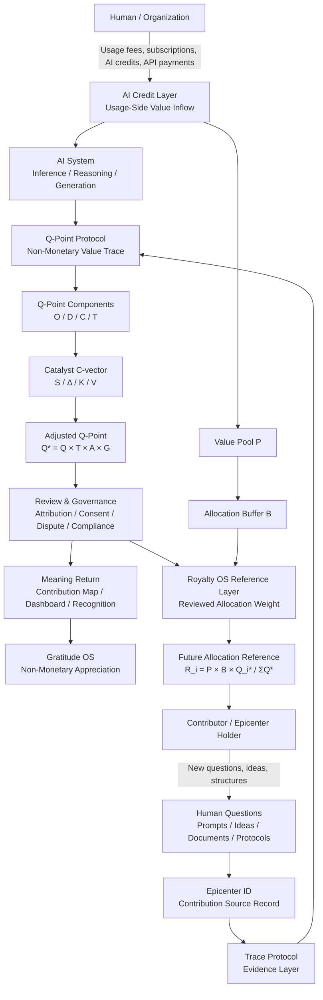

# Value Circulation Diagram

**Status:** Working Draft
**Version:** 0.1.0
**Date:** 2026-06-02
**Category:** Value Circulation / Q-Point / AI Credit Bridge / Royalty OS
**Related Documents:**

* `docs/q-point-protocol-v0.2.md`
* `docs/q-point-scoring-model.md`
* `docs/ai-credit-to-royalty-os-bridge.md`
* `schemas/q-point-record.schema.json`
* `examples/q-point-record.example.yaml`

---

## 1. Purpose

This document provides a high-level value circulation diagram for the Q-Point Protocol ecosystem.

It shows how usage-side AI value inflows, Q-Point records, review processes, and future Royalty OS allocation references may connect into a closed value circulation loop.

This document is conceptual.

It does not define an automatic payment system.

It does not convert AI credits into money.

It does not create legal claims, debts, securities, or automatic royalty rights.

Its purpose is to visualize the relationship between:

* AI Credit Layer
* Q-Point Protocol
* Catalyst C-vector
* Trace Persistence
* Review and Governance
* Gratitude OS
* Royalty OS
* Future value circulation

---

## 2. Core Flow

The core circulation model is:

```text
Human / Organization
  ↓
AI usage-side value inflow
  ↓
AI system
  ↓
Q-Point value trace
  ↓
Review and governance
  ↓
Meaning return / Gratitude OS
  ↓
Future Royalty OS allocation reference
  ↓
Human / Contributor
```

This creates a conceptual loop:

```text
Human → AI → Q-Point → Review → Return → Human
```

---

## 3. Mermaid Diagram



---

## 4. Layer Explanation

### 4.1 AI Credit Layer

The AI Credit Layer represents usage-side value inflow.

This may include:

* AI credits
* API usage fees
* inference credits
* subscription-derived AI usage value
* compute-based platform usage
* organizational AI spending

This layer represents value entering AI systems from users, developers, organizations, or platforms.

In this repository, this is treated as:

```text
Usage-Side Value Inflow
```

It is not treated as tax, public money, legal revenue, or mandatory allocation.

---

### 4.2 AI System Layer

The AI System Layer represents AI-mediated reasoning, generation, retrieval, inference, and transformation.

At this layer, AI systems may be influenced by:

* questions
* prompts
* documents
* prior traces
* conceptual structures
* protocols
* user interactions
* external knowledge records

The AI system consumes usage-side value and produces outputs.

However, its reasoning may also be shaped by human intellectual contribution.

---

### 4.3 Epicenter ID Layer

The Epicenter ID identifies the original contribution.

A contribution may be:

* a question
* a prompt
* an idea
* a concept
* a document
* a protocol
* a conversation
* a structural insight

Example:

```yaml
epicenter:
  epicenter_id: "qsrc-2026-000001"
  source_type: "question"
  origin_actor_type: "human"
  origin_platform: "chat_interface"
```

The Epicenter ID prevents value tracking from depending only on platform identity or user popularity.

The primary unit is the contribution itself.

---

### 4.4 Trace Protocol Layer

The Trace Protocol Layer records evidence.

It answers:

```text
Where did this contribution come from?
How did it move?
What records are connected to it?
```

Trace Protocol is the evidence layer.

Q-Point Protocol is the value trace layer.

```text
Trace Protocol = Evidence
Q-Point Protocol = Value interpretation
```

---

### 4.5 Q-Point Protocol Layer

The Q-Point Protocol Layer records the non-monetary value trace of a contribution.

It does not create payment rights.

It does not create ownership claims.

It records structured contribution value.

Core components:

```text
Q = 0.30O + 0.25D + 0.30C + 0.15T
```

Where:

* `O` = Originality
* `D` = Depth
* `C` = Catalyst
* `T` = Trace Persistence

---

### 4.6 Catalyst C-vector Layer

The Catalyst C-vector records how a contribution moved AI-mediated reasoning.

```text
C = 0.35S + 0.25Δ + 0.25K + 0.15V
```

Where:

* `S` = Self-Question Trigger
* `Δ` = Confidence Shift
* `K` = Internal Conflict Detection
* `V` = Viewpoint Shift

This allows Q-Point to record not only that a contribution mattered, but how it moved the reasoning process.

---

### 4.7 Adjusted Q-Point Layer

Before any future allocation reference, raw Q-Point should be adjusted.

Recommended formula:

```text
Q_i* = Q_i × T_i × A_i × G_i
```

Where:

* `Q_i*` = adjusted Q-Point
* `Q_i` = base Q-Point
* `T_i` = Trace Persistence factor
* `A_i` = Attribution Confidence factor
* `G_i` = Governance Review factor

This prevents raw scores from being treated as final allocation weights.

---

### 4.8 Review and Governance Layer

The Review and Governance Layer checks:

* attribution confidence
* trace reliability
* consent
* dispute status
* privacy
* licensing conditions
* governance readiness
* anti-gaming safeguards

This layer is essential.

Q-Point should not become an automatic payout machine.

High-value or allocation-relevant records should be reviewed.

---

### 4.9 Meaning Return Layer

Before monetary return, Q-Point can produce meaning return.

Meaning return may include:

* contribution maps
* dashboards
* recognition records
* gratitude messages
* trace visualizations
* non-monetary certificates
* intellectual lineage graphs

This layer allows contributors to see how their questions and ideas shaped AI-mediated knowledge systems.

---

### 4.10 Gratitude OS Layer

Gratitude OS expresses non-monetary appreciation.

It may use Q-Point records as structured reference data.

Possible examples:

* “This question generated high-depth reasoning.”
* “This contribution created a reusable structural framework.”
* “This idea triggered a strong Catalyst C-vector response.”
* “This Epicenter ID became a recurring trace point.”

Gratitude OS returns meaning before money.

---

### 4.11 Royalty OS Reference Layer

Royalty OS may use reviewed Q-Point records as future allocation reference data.

The recommended bridge formula is:

```text
R_i = P × B × (Q_i* / ΣQ*)
```

Where:

* `R_i` = allocation reference amount or ratio
* `P` = usage-side value pool
* `B` = allocation buffer rate
* `Q_i*` = adjusted Q-Point
* `ΣQ*` = total adjusted Q-Point across eligible records

This formula defines allocation reference logic only.

It does not execute payment.

---

## 5. Simplified ASCII Diagram

```text
────────────────────────────────────────────
VALUE CIRCULATION MODEL
────────────────────────────────────────────

[Human / Organization]
        │
        │ usage fees / AI credits / subscriptions
        ▼
[AI Credit Layer]
        │
        │ usage-side value inflow
        ▼
[AI System]
        │
        │ inference / reasoning / generation
        ▼
[Q-Point Protocol]
        │
        │ non-monetary value trace
        ▼
[Q-Point Components]
        │
        │ O / D / C / T
        ▼
[Catalyst C-vector]
        │
        │ S / Δ / K / V
        ▼
[Adjusted Q-Point]
        │
        │ Q* = Q × T × A × G
        ▼
[Review & Governance]
        │
        ├──────────────► [Gratitude OS]
        │                    │
        │                    ▼
        │              meaning return
        │
        └──────────────► [Royalty OS Reference]
                             │
                             ▼
                    R_i = P × B × Q_i* / ΣQ*
                             │
                             ▼
                    [Contributor / Epicenter Holder]

────────────────────────────────────────────
```

---

## 6. Value Circulation Formula

The recommended reference formula is:

```text
R_i = P × B × (Q_i* / ΣQ*)
```

Where:

```text
Q_i* = Q_i × T_i × A_i × G_i
```

### 6.1 Symbol Table

| Symbol | Meaning                                                    |
| ------ | ---------------------------------------------------------- |
| `P`    | Value pool derived from usage-side AI value inflow.        |
| `B`    | Allocation buffer rate.                                    |
| `Q_i`  | Base Q-Point score for contribution `i`.                   |
| `Q_i*` | Adjusted Q-Point score for contribution `i`.               |
| `T_i`  | Trace Persistence factor.                                  |
| `A_i`  | Attribution Confidence factor.                             |
| `G_i`  | Governance Review factor.                                  |
| `ΣQ*`  | Total adjusted Q-Point across eligible records.            |
| `R_i`  | Allocation reference amount or ratio for contribution `i`. |

---

## 7. Non-Automatic Conversion Rule

This diagram must not be interpreted as an automatic financial system.

The following rule is required:

```text
Q-Point records and AI Credit bridge records do not automatically create payment rights.
```

Any real distribution requires:

* contributor consent
* licensing review
* platform policy
* legal framework
* tax handling
* dispute process
* governance review
* payout infrastructure

The diagram shows a possible future value circulation architecture.

It does not execute allocation.

---

## 8. Relationship to Existing Documents

| Document                                 | Relationship                                                                                    |
| ---------------------------------------- | ----------------------------------------------------------------------------------------------- |
| `docs/q-point-protocol-v0.2.md`          | Defines the v0.2 protocol structure and C-vector integration.                                   |
| `docs/q-point-scoring-model.md`          | Defines the Q-Point scoring formulas and C-vector interpretation.                               |
| `docs/ai-credit-to-royalty-os-bridge.md` | Defines the bridge formula between usage-side value inflow and Royalty OS allocation reference. |
| `examples/q-point-record.example.yaml`   | Provides a concrete Q-Point record example.                                                     |
| `schemas/q-point-record.schema.json`     | Validates Q-Point record structure.                                                             |

---

## 9. Design Interpretation

The value circulation model can be interpreted as a closed loop.

```text
Human creates questions.
AI is shaped by those questions.
AI usage generates value inflow.
Q-Point records contribution value.
Review converts value traces into trusted references.
Gratitude OS returns meaning.
Royalty OS may later return value.
Returned value supports future human creativity.
```

This is the core circulation:

```text
Question → AI → Trace → Q-Point → Review → Return → New Question
```

---

## 10. Summary

The Value Circulation Diagram shows how Q-Point Protocol may connect AI usage-side value inflow with future Royalty OS allocation references.

It contains four major movements:

1. Value enters AI systems through usage.
2. Human contributions shape AI-mediated reasoning.
3. Q-Point records contribution value as a non-monetary trace.
4. Reviewed records may support gratitude, attribution, licensing, or future allocation.

The key principle remains:

```text
Record first.
Interpret second.
Review before allocation.
Distribute only under separate governance.
```

This diagram represents the circulation layer of the Q-Point Protocol ecosystem.

It is the bridge between AI usage value and human intellectual contribution.
